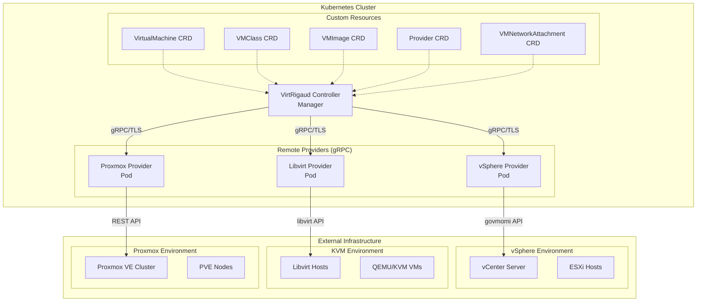

# VirtRigaud

A Kubernetes operator for managing virtual machines across multiple hypervisors.

## Overview

Virtrigaud is a Kubernetes operator that enables declarative management of virtual machines across different hypervisor platforms. It provides a unified API for provisioning and managing VMs on vSphere, Libvirt/KVM, Proxmox VE, and other hypervisors through a clean provider interface.

## Features

- **Multi-Hypervisor Support**: Manage VMs across vSphere, Libvirt/KVM, and Proxmox VE simultaneously
- **Declarative API**: Define VM resources using Kubernetes CRDs with stable v1beta1 API
- **Production-Ready Providers**: Full integration for vSphere (govmomi), Libvirt/KVM, and Proxmox VE
- **Cloud-Init Support**: Initialize VMs with cloud-init configuration across all providers
- **Network Management**: Configure VM networking with provider-specific settings
- **Power Management**: Control VM power state (On/Off/Reboot) uniformly
- **Async Task Support**: Handles long-running operations (vSphere) and synchronous operations (Libvirt)
- **Resource Management**: CPU, memory, disk configuration across hypervisors
- **Storage Management**: Provider-specific storage handling (datastores vs storage pools)
- **Finalizer-based Cleanup**: Ensures proper cleanup of external resources

## API Support

**API Version**: v1beta1

All resources use the v1beta1 API with comprehensive OpenAPI validation and type safety.

## Architecture

VirtRigaud uses a **Remote Provider** architecture for optimal scalability and reliability:

### Key Benefits

- **Scalability**: Each provider runs as independent pods with dedicated resources
- **Reliability**: Provider failures don't affect the manager or other providers  
- **Security**: Provider credentials are isolated to their respective pods
- **Flexibility**: Scale providers independently based on workload demands
- **Maintainability**: Update providers without affecting the core manager
- **Multi-tenancy**: Different providers for different teams/environments
- **Updates**: Rolling updates of providers without manager downtime

### Architecture Overview Diagram



## Quick Start

### Installation via Helm (Recommended)

1. **Add the Helm repository**:
   ```bash
   helm repo add virtrigaud https://projectbeskar.github.io/virtrigaud
   helm repo update
   ```

2. **Install VirtRigaud** (Manager only - Providers are created via CRs):
   ```bash
   # Install VirtRigaud manager (CRDs included automatically)
   # Note: Providers are NOT enabled via Helm - they are created as Provider CRs
   helm install virtrigaud virtrigaud/virtrigaud \
     -n virtrigaud-system --create-namespace \
     --set providers.vsphere.enabled=false \
     --set providers.libvirt.enabled=false \
     --set providers.proxmox.enabled=false
   
   # Or simply install with default values (all providers disabled by default in future versions)
   helm install virtrigaud virtrigaud/virtrigaud -n virtrigaud-system --create-namespace
   
   # To disable automatic CRD upgrades:
   helm install virtrigaud virtrigaud/virtrigaud \
     -n virtrigaud-system --create-namespace \
     --set crdUpgrade.enabled=false
   ```
   
   > **Important**: Do not enable providers via Helm flags. Instead, create Provider CRs (see step 1 in "Using VirtRigaud" below) which automatically deploy provider pods with proper credential management.

3. **Verify the installation**:
   ```bash
   # Check pods
   kubectl get pods -n virtrigaud-system
   
   # Check CRDs
   kubectl get crd | grep virtrigaud
   
   # Verify CRD upgrade job completed (if enabled)
   kubectl get jobs -n virtrigaud-system -l app.kubernetes.io/component=crd-upgrade
   ```

4. **Upgrade VirtRigaud** (CRDs are automatically upgraded):
   ```bash
   # Standard upgrade - CRDs are automatically updated
   helm upgrade virtrigaud virtrigaud/virtrigaud -n virtrigaud-system
   
   # The chart uses Helm hooks to apply CRDs during upgrade
   # No manual CRD management needed!
   
   # To upgrade provider images, update the Provider CR's spec.runtime.image field:
   kubectl patch provider <provider-name> -n <namespace> --type=merge \
     -p '{"spec":{"runtime":{"image":"ghcr.io/projectbeskar/virtrigaud/provider-libvirt:v0.3.18-dev"}}}'
   ```

### Development Installation

1. **Install the CRDs**:
   ```bash
   make install
   ```

2. **Run the controller**:
   ```bash
   make run
   ```

### Using VirtRigaud

1. **Create a Provider** (one-time setup per hypervisor):

   First, create a credentials secret in the namespace where you'll create the Provider:
   
   ```bash
   # For Libvirt (SSH authentication)
   kubectl create secret generic libvirt-creds -n default \
     --from-literal=username=your-ssh-username \
     --from-literal=password='your-ssh-password'
   
   # Or with SSH key (recommended)
   kubectl create secret generic libvirt-creds -n default \
     --from-literal=username=your-ssh-username \
     --from-file=ssh-privatekey=~/.ssh/id_rsa
   
   # For vSphere
   kubectl create secret generic vsphere-creds -n default \
     --from-literal=username=administrator@vsphere.local \
     --from-literal=password='your-password'
   ```

   Then create the Provider CR that references the secret:

   **Libvirt/KVM Provider Example:**
   ```bash
   kubectl apply -f - <<EOF
   apiVersion: infra.virtrigaud.io/v1beta1
   kind: Provider
   metadata:
     name: libvirt-kvm
     namespace: default
   spec:
     type: libvirt
     endpoint: "qemu+ssh://192.168.1.10/system"
     credentialSecretRef:
       name: libvirt-creds  # Secret in the same namespace (default)
     runtime:
       mode: Remote
       image: "ghcr.io/projectbeskar/virtrigaud/provider-libvirt:latest"
       service:
         port: 9090
   EOF
   ```

   **vSphere Provider Example:**
   ```bash
   kubectl apply -f - <<EOF
   apiVersion: infra.virtrigaud.io/v1beta1
   kind: Provider
   metadata:
     name: vsphere-datacenter
     namespace: default
   spec:
     type: vsphere
     endpoint: "https://vcenter.example.com:443"
     credentialSecretRef:
       name: vsphere-creds
     runtime:
       mode: Remote
       image: "virtrigaud/provider-vsphere:latest"
       service:
         port: 9090
   EOF
   ```

   > **How it works**: When you create a Provider CR, the VirtRigaud Provider Controller:
   > 1. Creates a dedicated Deployment in the same namespace as the Provider CR
   > 2. Mounts the credentials secret specified in `credentialSecretRef`
   > 3. Creates a Service for the provider pod
   > 4. The provider pod connects to your hypervisor using the mounted credentials
   > 
   > Each Provider CR gets its own isolated provider deployment with its own credentials. This is more secure than shared multi-tenant providers. See [Remote Provider Documentation](docs/REMOTE_PROVIDERS.md#configuration-flow-provider-resource--provider-pod) for details.

2. **Create VM resources using the Provider**:
   ```bash
   # Apply VM definition that references the provider
   kubectl apply -f docs/examples/complete-example.yaml
   
   # Proxmox VE example (v1beta1 API)
   kubectl apply -f docs/examples/proxmox-complete-example.yaml
   
   # Only v1beta1 API is supported as of v0.2.1
   
   # Multi-provider example (vSphere, Libvirt, and Proxmox)
   kubectl apply -f docs/examples/multi-provider-example.yaml
   
   # Or step by step:
   kubectl create secret generic vsphere-creds \
     --from-literal=username=administrator@vsphere.local \
     --from-literal=password=your-password
   kubectl apply -f docs/examples/provider-vsphere.yaml
   kubectl apply -f docs/examples/vmclass-small.yaml
   kubectl apply -f docs/examples/vmimage-ubuntu.yaml
   kubectl apply -f docs/examples/vmnetwork-app.yaml
   kubectl apply -f docs/examples/vm-ubuntu-small.yaml
   ```

2. **Monitor VM creation**:
   ```bash
   kubectl get virtualmachine -w
   ```

For detailed instructions, see [Quick Start Guide](docs/getting-started/quickstart.md).

## CRDs

- **VirtualMachine**: Represents a virtual machine instance
- **VMClass**: Defines resource allocation (CPU, memory, disk, etc.)
- **VMImage**: References base templates/images
- **VMNetworkAttachment**: Defines network configurations
- **Provider**: Configures hypervisor connection details

## Supported Providers

### Production-Ready Providers

- **vSphere** - **GA**
  - VM creation from templates
  - Power management (On/Off/ShutDown)
  - Resource configuration (CPU/Memory/Disks)
  - **Hot reconfiguration** (CPU/Memory/Disk resizing)
  - **VM cloning** (full and linked clones)
  - **Async task tracking** with TaskStatus RPC
  - **Web console URLs** for direct VM access
  - Cloud-init support via guestinfo
  - Network configuration with portgroups
  - Snapshot management with memory state
  
- **Libvirt/KVM** - **Production Ready**
  - VM creation from qcow2 images
  - Power management (On/Off/Reboot)  
  - Resource configuration (CPU/Memory/Disks)
  - **Reconfiguration** (CPU/Memory/Disk - requires VM restart)
  - **VNC console URLs** for remote VM access
  - Cloud-init support via nocloud ISO
  - Network configuration with bridges/networks
  - Storage pool and volume management
  - Snapshot management (storage-dependent)
  - QEMU guest agent integration

- **Proxmox VE** - **Production Ready (Beta)**
  - VM creation from templates or ISO
  - Power management (On/Off/Reboot)
  - **Hot-plug reconfiguration** (CPU/Memory/Disk)
  - **Snapshot management** (with memory state)
  - **Guest agent integration** for accurate IP detection
  - **Multi-NIC networking** with VLAN support
  - **Linked/Full cloning**
  - **Image import** from URLs
  - Cloud-init support with static IPs
  - Async task monitoring with jittered backoff
  - Complete CRD integration

### Provider Feature Matrix

| Feature | vSphere | Libvirt | Proxmox | Notes |
|---------|---------|---------|---------|-------|
| **Core Operations** | ✅ | ✅ | ✅ | Create/Delete/Power/Describe |
| **Reconfiguration** | ✅ | ⚠️ | ✅ | CPU/Memory/Disk changes (Libvirt requires restart) |
| **Disk Expansion** | ✅ | ✅ | ✅ | Online disk growth |
| **Snapshots** | ✅ | ✅ | ✅ | VM state snapshots |
| **Memory Snapshots** | ✅ | ❌ | ✅ | Include RAM in snapshots |
| **Cloning** | ✅ | ✅ | ✅ | Full and linked clones |
| **Linked Clones** | ✅ | ❌ | ✅ | COW-based fast clones |
| **Task Tracking** | ✅ | N/A | ✅ | Async operation monitoring |
| **Console URLs** | ✅ | ✅ | ⚠️ | vSphere web console, VNC (Proxmox planned) |
| **Guest Agent** | ✅ | ✅ | ✅ | IP detection and guest info |
| **Image Import** | ❌ | ✅ | ✅ | Import from URLs/files |
| **Multi-NIC** | ✅ | ✅ | ✅ | Multiple network interfaces |
| **VLAN Support** | ✅ | ✅ | ✅ | 802.1Q VLAN tagging |
| **Static IPs** | ✅ | ✅ | ✅ | Cloud-init network config |
| **Remote Deployment** | ✅ | ✅ | ✅ | gRPC-based providers |

### Future Roadmap

- **Firecracker**: Serverless microVM support
- **Cloud-Hypervisor**: Serverless microVM support
- **QEMU**: Direct QEMU integration


## Troubleshooting

### Missing CRDs

If CRDs are missing after Helm install:

1. **Check if CRDs were skipped**:
   ```bash
   helm get values virtrigaud -n virtrigaud-system | grep skip-crds
   ```

2. **Manually install CRDs**:
   ```bash
   kubectl apply -f charts/virtrigaud/crds/
   ```

3. **Re-install with CRDs**:
   ```bash
   helm uninstall virtrigaud -n virtrigaud-system
   helm install virtrigaud virtrigaud/virtrigaud -n virtrigaud-system --create-namespace
   ```

## Development

### Prerequisites

- Go 1.22+
- Docker
- kubectl
- A Kubernetes cluster

### Local Testing

Test GitHub Actions workflows locally before pushing to save costs and catch issues early:

```bash
# Setup local testing environment
./hack/test-workflows-locally.sh setup

# Quick lint check (run before every commit)
./hack/test-lint-locally.sh

# Comprehensive CI testing (run before PRs)
./hack/test-ci-locally.sh

# Test Helm charts with Kind cluster
./hack/test-helm-locally.sh

# Simulate release workflow
./hack/test-release-locally.sh v0.2.0-test
```

See [Testing Workflows Locally](docs/TESTING_WORKFLOWS_LOCALLY.md) for detailed instructions.

### Building

```bash
# Build the manager binary
make build

# Build the container image
make docker-build

# Run tests
make test

# Generate code and manifests
make generate manifests
```

### Running locally

```bash
# Install CRDs
make install

# Run the controller
make run
```

## Documentation

- [Quick Start Guide](docs/getting-started/quickstart.md) - Get started in 15 minutes
- [CRD Reference](docs/CRDs.md) - Complete API documentation
- [Examples](docs/EXAMPLES.md) - Practical examples and use cases
- [CLI Tools Reference](docs/CLI.md) - Command-line interface guide
- [Upgrade Guide](docs/UPGRADE.md) - Version upgrade procedures
- [Provider Development](docs/PROVIDERS.md) - How to add new hypervisors
- [Provider Catalog](docs/catalog.md) - Browse available providers
- [Provider Tutorial](docs/providers/tutorial.md) - Complete provider development guide
- [Versioning & Breaking Changes](docs/providers/versioning.md)

### Provider-Specific Documentation

- [vSphere Provider](docs/providers/vsphere.md) - vCenter/ESXi integration
- [Libvirt Provider](docs/providers/libvirt.md) - KVM/QEMU virtualization  
- [Proxmox VE Provider](docs/providers/proxmox.md) - Proxmox Virtual Environment

## Contributing

Contributions are welcome! Please see our [contribution guidelines](CONTRIBUTING.md).

## License

This project is licensed under the Apache License 2.0 - see the [LICENSE](LICENSE) file for details.