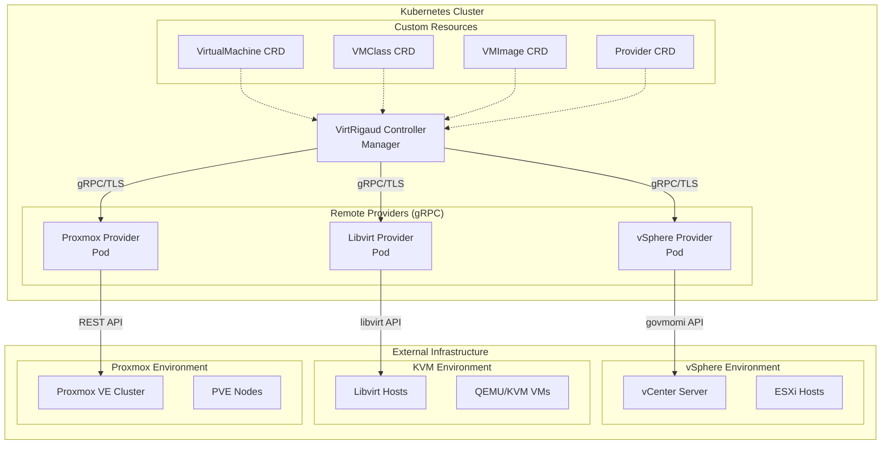

# VirtRigaud

A Kubernetes operator for managing virtual machines across multiple hypervisors.

## Overview

Virtrigaud is a Kubernetes operator that enables declarative management of virtual machines across different hypervisor platforms. It provides a unified API for provisioning and managing VMs on vSphere, Libvirt/KVM, Proxmox VE, and other hypervisors through a clean provider interface.

## Features

- **Multi-Hypervisor Support**: Manage VMs across vSphere, Libvirt/KVM, and Proxmox VE simultaneously
- **Declarative API**: Define VM resources using Kubernetes CRDs with API versioning (v1alpha1/v1beta1)
- **Production-Ready Providers**: Full integration for vSphere (govmomi), Libvirt/KVM, and Proxmox VE
- **API Conversion**: Seamless conversion between v1alpha1 and v1beta1 API versions via webhooks
- **Cloud-Init Support**: Initialize VMs with cloud-init configuration across all providers
- **Network Management**: Configure VM networking with provider-specific settings
- **Power Management**: Control VM power state (On/Off/Reboot) uniformly
- **Async Task Support**: Handles long-running operations (vSphere) and synchronous operations (Libvirt)
- **Resource Management**: CPU, memory, disk configuration across hypervisors
- **Storage Management**: Provider-specific storage handling (datastores vs storage pools)
- **Finalizer-based Cleanup**: Ensures proper cleanup of external resources

## API Support

**Default API**: v1beta1 - The recommended stable API for all new deployments.

**Legacy API**: v1alpha1 - Served for compatibility but deprecated. See the [upgrade guide](docs/upgrade/) for migration instructions.

All resources support seamless conversion between API versions via webhooks. Conversions are lossless and do not apply defaults. Any defaults (e.g., powerState) are applied by admission webhooks or controllers, not by the API conversion layer.

## Architecture

VirtRigaud supports both **In-Process** and **Remote** provider deployment models:

### In-Process Model (Traditional)
```
                    ┌─────────────────────────────────────────┐
                    │            Kubernetes Cluster           │
                    │                                         │
┌─────────────────┐ │ ┌─────────────────┐                    │
│  VirtualMachine │ │ │   Controller    │                    │
│      CRD        │─┼─│   (Manager)     │                    │
└─────────────────┘ │ │                 │                    │
┌─────────────────┐ │ │  ┌──────────────┴──────────────┐     │
│    VMClass      │─┼─│  │        Provider Interface   │     │
│      CRD        │ │ │  └──────────────┬──────────────┘     │
└─────────────────┘ │ │                 │                    │
┌─────────────────┐ │ │    ┌────────────┼────────────┐       │
│    VMImage      │─┼─│    │            │            │       │
│      CRD        │ │ │ ┌──▼───┐    ┌───▼───┐   ┌───▼────┐  │
└─────────────────┘ │ │ │vSphere│    │Libvirt│   │Proxmox │  │
┌─────────────────┐ │ │ │Provider│   │Provider│  │Provider│  │
│    Provider     │─┼─│ └───────┘    └───────┘   └────────┘  │
│      CRD        │ │ └─────────────────────────────────────┘
└─────────────────┘ │
                    │ ┌─────────────────────────────────────┐
                    │ │         External Infrastructure      │
                    │ │                                     │
                    │ │ ┌──────────┐ ┌─────────┐ ┌─────────┐│
                    │ │ │ vSphere  │ │ Libvirt │ │Proxmox  ││
                    │ │ │   ESXi   │ │   KVM   │ │   VE    ││
                    │ │ └──────────┘ └─────────┘ └─────────┘│
                    │ └─────────────────────────────────────┘
                    └─────────────────────────────────────────┘
```

### Remote Provider Model (Recommended for Production)
```
                    ┌─────────────────────────────────────────┐
                    │            Kubernetes Cluster           │
                    │                                         │
┌─────────────────┐ │ ┌─────────────────┐                    │
│  VirtualMachine │ │ │   Controller    │                    │
│      CRD        │─┼─│   (Manager)     │                    │
└─────────────────┘ │ │                 │                    │
┌─────────────────┐ │ │                 │                    │
│    VMClass      │─┼─│                 │                    │
│      CRD        │ │ │                 │                    │
└─────────────────┘ │ │                 │                    │
┌─────────────────┐ │ │                 │  gRPC/TLS          │
│    VMImage      │─┼─│                 ├──────────────────► │
│      CRD        │ │ │                 │                    │
└─────────────────┘ │ └─────────────────┘                    │
┌─────────────────┐ │                                        │
│    Provider     │ │ ┌─────────────────────────────────────┐│
│      CRD        │─┼─│        Remote Providers              ││
└─────────────────┘ │ │                                     ││
                    │ │ ┌──────────┐ ┌─────────┐ ┌─────────┐││
                    │ │ │ vSphere  │ │ Libvirt │ │Proxmox  │││
                    │ │ │ Provider │ │ Provider│ │Provider │││
                    │ │ │   Pod    │ │   Pod   │ │  Pod    │││
                    │ │ └──────────┘ └─────────┘ └─────────┘││
                    │ └─────────────────────────────────────┘│
                    │                                        │
                    │ ┌─────────────────────────────────────┐│
                    │ │         External Infrastructure      ││
                    │ │                                     ││
                    │ │ ┌──────────┐ ┌─────────┐ ┌─────────┐││
                    │ │ │ vSphere  │ │ Libvirt │ │Proxmox  │││
                    │ │ │   ESXi   │ │   KVM   │ │   VE    │││
                    │ │ └──────────┘ └─────────┘ └─────────┘││
                    │ └─────────────────────────────────────┘│
                    └─────────────────────────────────────────┘
```

**Key Benefits of Remote Model:**
- **Isolation**: Provider failures don't affect the core manager
- **Scalability**: Independent scaling of providers
- **Security**: Fine-grained RBAC and NetworkPolicies per provider
- **Multi-tenancy**: Different providers for different teams/environments
- **Updates**: Rolling updates of providers without manager downtime

### Architecture Overview Diagram



## Quick Start

### Installation via Helm (Recommended)

1. **Add the Helm repository**:
   ```bash
   helm repo add virtrigaud https://projectbeskar.github.io/virtrigaud
   helm repo update
   ```

2. **Install VirtRigaud**:
   ```bash
   # Basic installation (CRDs included automatically)
   helm install virtrigaud virtrigaud/virtrigaud -n virtrigaud --create-namespace
   
   # With custom values
   helm install virtrigaud virtrigaud/virtrigaud \
     -n virtrigaud --create-namespace \
     --set webhooks.enabled=true \
     --set providers.vsphere.enabled=true \
     --set providers.libvirt.enabled=false \
     --set providers.proxmox.enabled=true
   
   # Skip CRDs if already installed separately
   helm install virtrigaud virtrigaud/virtrigaud -n virtrigaud --create-namespace --skip-crds
   ```

3. **Verify the installation**:
   ```bash
   # Check pods
   kubectl get pods -n virtrigaud
   
   # Check CRDs
   kubectl get crd | grep virtrigaud
   
   # Verify API conversion is working
   kubectl get crd virtualmachines.infra.virtrigaud.io -o yaml | yq '.spec.conversion'
   ```

### Development Installation

1. **Install the CRDs**:
   ```bash
   make install
   ```

2. **Run the controller**:
   ```bash
   make run
   ```

### Using VirtRigaud

1. **Create provider and VM resources**:
   ```bash
   # vSphere example (v1beta1 API)
   kubectl apply -f examples/complete-example.yaml
   
   # Libvirt/KVM example (v1beta1 API)
   kubectl apply -f examples/libvirt-complete-example.yaml
   
   # Proxmox VE example (v1beta1 API)
   kubectl apply -f examples/proxmox-complete-example.yaml
   
   # For v1alpha1 examples (legacy), see examples/upgrade/alpha/
   
   # Multi-provider example (vSphere, Libvirt, and Proxmox)
   kubectl apply -f examples/multi-provider-example.yaml
   
   # Or step by step:
   kubectl create secret generic vsphere-creds \
     --from-literal=username=administrator@vsphere.local \
     --from-literal=password=your-password
   kubectl apply -f examples/provider-vsphere.yaml
   kubectl apply -f examples/vmclass-small.yaml
   kubectl apply -f examples/vmimage-ubuntu.yaml
   kubectl apply -f examples/vmnetwork-app.yaml
   kubectl apply -f examples/vm-ubuntu-small.yaml
   ```

2. **Monitor VM creation**:
   ```bash
   kubectl get virtualmachine -w
   ```

For detailed instructions, see [QUICKSTART.md](QUICKSTART.md).

## CRDs

- **VirtualMachine**: Represents a virtual machine instance
- **VMClass**: Defines resource allocation (CPU, memory, etc.)
- **VMImage**: References base templates/images
- **VMNetworkAttachment**: Defines network configurations
- **Provider**: Configures hypervisor connection details

## Supported Providers

### Production-Ready Providers

- **vSphere** (govmomi-based) - ✅ **GA**
  - VM creation from templates
  - Power management (On/Off/Reboot)
  - Resource configuration (CPU/Memory/Disks)
  - Cloud-init support via guestinfo
  - Network configuration with portgroups
  - Async task monitoring
  
- **Libvirt/KVM** (libvirt-go-based) - ✅ **GA**
  - VM creation from qcow2 images
  - Power management (On/Off/Reboot)  
  - Resource configuration (CPU/Memory/Disks)
  - Cloud-init support via nocloud ISO
  - Network configuration with bridges/networks
  - Storage pool and volume management

- **Proxmox VE** (REST API-based) - ✅ **GA**
  - VM creation from templates or ISO
  - Power management (On/Off/Reboot)
  - **Hot-plug reconfiguration** (CPU/Memory/Disk)
  - **Snapshot management** (with memory state)
  - **Multi-NIC networking** with VLAN support
  - **Linked/Full cloning**
  - **Image import** from URLs
  - Cloud-init support with static IPs
  - Async task monitoring with jittered backoff

### Provider Feature Matrix

| Feature | vSphere | Libvirt | Proxmox | Notes |
|---------|---------|---------|---------|-------|
| **Core Operations** | ✅ | ✅ | ✅ | Create/Delete/Power/Describe |
| **Hot Reconfiguration** | ⚠️ Limited | ❌ | ✅ | CPU/Memory online changes |
| **Disk Expansion** | ✅ | ✅ | ✅ | Online disk growth |
| **Snapshots** | ✅ | ✅ | ✅ | VM state snapshots |
| **Memory Snapshots** | ✅ | ❌ | ✅ | Include RAM in snapshots |
| **Cloning** | ✅ | ✅ | ✅ | VM duplication |
| **Linked Clones** | ✅ | ❌ | ✅ | COW-based fast clones |
| **Image Import** | ❌ | ✅ | ✅ | Import from URLs/files |
| **Multi-NIC** | ✅ | ✅ | ✅ | Multiple network interfaces |
| **VLAN Support** | ✅ | ✅ | ✅ | 802.1Q VLAN tagging |
| **Static IPs** | ✅ | ✅ | ✅ | Cloud-init network config |
| **Remote Deployment** | ✅ | ✅ | ✅ | gRPC-based providers |

### Future Roadmap

- **Firecracker**: Serverless microVM support
- **QEMU**: Direct QEMU integration
- **Hyper-V**: Windows virtualization platform
- **OpenStack**: Cloud infrastructure integration

## Troubleshooting

### API Conversion Issues

If you encounter issues with API conversion between v1alpha1 and v1beta1:

1. **Verify conversion webhook is running**:
   ```bash
   kubectl get pods -n virtrigaud -l app=virtrigaud-webhook
   ```

2. **Check conversion webhook configuration**:
   ```bash
   kubectl get crd virtualmachines.infra.virtrigaud.io -o yaml | yq '.spec.conversion'
   ```

3. **Verify webhook service**:
   ```bash
   kubectl get svc -n virtrigaud virtrigaud-webhook
   ```

4. **Check webhook logs**:
   ```bash
   kubectl logs -n virtrigaud -l app=virtrigaud-webhook
   ```

### Missing CRDs

If CRDs are missing after Helm install:

1. **Check if CRDs were skipped**:
   ```bash
   helm get values virtrigaud -n virtrigaud | grep skip-crds
   ```

2. **Manually install CRDs**:
   ```bash
   kubectl apply -f charts/virtrigaud/crds/
   ```

3. **Re-install with CRDs**:
   ```bash
   helm uninstall virtrigaud -n virtrigaud
   helm install virtrigaud virtrigaud/virtrigaud -n virtrigaud --create-namespace
   ```

## Development

### Prerequisites

- Go 1.22+
- Docker
- kubectl
- A Kubernetes cluster

### Building

```bash
# Build the manager binary
make build

# Build the container image
make docker-build

# Run tests
make test

# Generate code and manifests
make generate manifests
```

### Running locally

```bash
# Install CRDs
make install

# Run the controller
make run
```

## Documentation

- [Quick Start Guide](QUICKSTART.md) - Get started in 5 minutes
- [CRD Reference](docs/CRDs.md) - Complete API documentation
- [Examples](docs/EXAMPLES.md) - Practical examples and use cases
- [Provider Development](docs/PROVIDERS.md) - How to add new hypervisors
- [Provider Catalog](docs/catalog.md) - Browse available providers
- [Provider Tutorial](docs/providers/tutorial.md) - Complete provider development guide
- [Versioning & Breaking Changes](docs/providers/versioning.md)

### Provider-Specific Documentation

- [vSphere Provider](docs/providers/vsphere.md) - vCenter/ESXi integration
- [Libvirt Provider](docs/providers/libvirt.md) - KVM/QEMU virtualization  
- [Proxmox VE Provider](docs/providers/proxmox.md) - Proxmox Virtual Environment

## Contributing

Contributions are welcome! Please see our [contribution guidelines](CONTRIBUTING.md).

## License

This project is licensed under the Apache License 2.0 - see the [LICENSE](LICENSE) file for details.