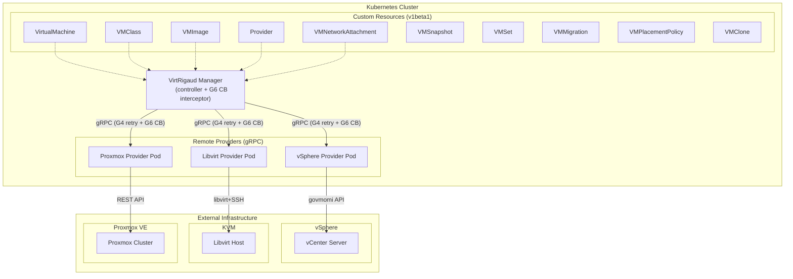

# VirtRigaud

A Kubernetes operator for managing virtual machines across multiple hypervisors.

**Version**: v0.3.9 — [CHANGELOG](CHANGELOG.md) | [Documentation](https://projectbeskar.github.io/virtrigaud)

## Overview

VirtRigaud is a Kubernetes operator that enables declarative management of virtual machines across different hypervisor platforms. It provides a unified API for provisioning and managing VMs on vSphere, Libvirt/KVM, and Proxmox VE through a remote gRPC provider architecture.

The manager reconciles Kubernetes custom resources; each hypervisor runs as a separate provider pod. Manager and provider pods communicate over gRPC. Credentials are scoped to the Provider CR and never flow through the manager.

## Features

- **Multi-Hypervisor Support**: vSphere, Libvirt/KVM, and Proxmox VE simultaneously
- **Cross-Provider VM Migration**: Migrate VMs between hypervisors using PVC-backed storage (currently tested: vSphere to Libvirt/KVM only; other directions are roadmap)
- **VM Cloning (VMClone)**: Full and linked clones, MVP — `source.vmRef`, same-provider (vSphere/Proxmox/Libvirt; libvirt: qcow2 overlay for linked, full copy for full)
- **VMSet CRD defined; controller not yet active**: Multi-VM replica set is defined but the controller is a stub that reports `Ready=False / ControllerNotImplemented`; rolling updates and replica management are roadmap
- **VMPlacementPolicy (reference-only)**: Placement rules (affinity, anti-affinity, resource constraints) expressed as a policy object referenced by `VirtualMachine.spec.placementRef`; no standalone enforcement controller
- **Declarative v1beta1 API**: Stable CRDs with OpenAPI validation
- **Cloud-Init Support**: Cross-provider VM initialisation via cloud-init
- **Power Management**: On/Off/Reboot/Graceful-Shutdown uniformly
- **Async Task Tracking**: Long-running vSphere and Proxmox operations tracked via TaskStatus RPC
- **Resource Reconfiguration**: CPU, memory, disk changes (online for vSphere/Proxmox; online for Libvirt when VM was created with `cpuHotAddEnabled`/`memoryHotAddEnabled`, otherwise power-cycle)
- **G6 Circuit Breaker**: One circuit breaker per Provider CR for automatic failure isolation (v0.3.6+)
- **Secure-by-default gRPC**: mTLS wired end-to-end (TLS 1.3, SNI, certwatcher hot-reload); provider pods fail closed without credentials (#147/#148, v0.3.7)
- **Libvirt SSH host-key verification**: `known_hosts` enforced by default; TOFU removed (#149, v0.3.7)
- **Observability**: 11 `virtrigaud_*` Prometheus metric families (1 deprecated in v0.3.6; removal in v0.4.0)

## Architecture

VirtRigaud uses a **Remote Provider** architecture for optimal scalability and reliability:


```mermaid
graph TB
    %% Kubernetes Cluster boundary
    subgraph "Kubernetes Cluster"

        %% CRDs
        subgraph "Custom Resources (v1beta1)"
            VM[VirtualMachine]
            VMC[VMClass]
            VMI[VMImage]
            PR[Provider]
            VMNA[VMNetworkAttachment]
            VMSN[VMSnapshot]
            VMSET[VMSet]
            VMMig[VMMigration]
            VMPP[VMPlacementPolicy]
            VMCL[VMClone]
        end

        %% Controller
        CTRL["VirtRigaud Manager
        (controller + G6 CB interceptor)"]

        %% Remote Providers
        subgraph "Remote Providers (gRPC)"
            VSP[vSphere Provider Pod]
            LVP[Libvirt Provider Pod]
            PXP[Proxmox Provider Pod]
        end

        %% Connections within cluster
        VM -.-> CTRL
        VMC -.-> CTRL
        VMI -.-> CTRL
        PR -.-> CTRL
        VMNA -.-> CTRL

        CTRL -->|"gRPC (G4 retry + G6 CB)"| VSP
        CTRL -->|"gRPC (G4 retry + G6 CB)"| LVP
        CTRL -->|"gRPC (G4 retry + G6 CB)"| PXP
    end

    %% External Infrastructure
    subgraph "External Infrastructure"
        subgraph "vSphere"
            VCENTER[vCenter Server]
        end
        subgraph "KVM"
            LIBVIRT[Libvirt Host]
        end
        subgraph "Proxmox VE"
            PVE[Proxmox Cluster]
        end
    end

    VSP -->|govmomi API| VCENTER
    LVP -->|libvirt+SSH| LIBVIRT
    PXP -->|REST API| PVE
```

### Security status (v0.3.9)

The following issues were open in v0.3.6 and resolved in v0.3.7; they are closed in this release:

- **mTLS wired end-to-end (#147, v0.3.7)**: manager↔provider gRPC TLS is wired through the provider `Resolver` with cert/key/CA loaded, TLS 1.3, SNI, and certwatcher hot-reload. Provider servers require and verify client certificates. Exception: the libvirt provider uses plaintext gRPC to its sidecar container and separately enforces SSH `known_hosts` — this is a documented maintainer choice, not a defect.
- **Provider gRPC auth enforced, fail-closed (#148, v0.3.7)**: provider pods require TLS credentials and fail closed (crash-loop) at startup if credentials are absent, unless explicitly opted into insecure mode via the provider runtime config.
- **Libvirt SSH host-key verification ON by default (#149, v0.3.7)**: the `no_verify=1` flag is removed; `known_hosts` is sourced from the credentials Secret. Trust-on-first-use (TOFU) is no longer the default.

Verify these controls are correctly configured before relying on them in regulated environments. For full security guidance, see the [Security Operations Guide](https://projectbeskar.github.io/virtrigaud/operations/security/).

## CRDs (10 total, all v1beta1)

| CRD | Short name | Controller | Description |
|-----|-----------|------------|-------------|
| VirtualMachine | vm | active | A virtual machine instance |
| VMClass | vmc | active | Resource profile (CPU, memory, disk) |
| VMImage | vmi | active | Base template or image reference |
| VMNetworkAttachment | vmna | active | Network configuration |
| Provider | prov | active | Hypervisor connection + runtime config |
| VMMigration | vmmig | active | Cross-provider VM migration |
| VMSnapshot | — | active | Snapshot lifecycle management |
| VMClone | vmclone | active (MVP) | Cloning operations — MVP: `source.vmRef` source, same-provider, full & linked clones |
| VMSet | vmset | not yet active | Multi-VM replica set — controller is a stub that reports `Ready=False / ControllerNotImplemented` |
| VMPlacementPolicy | — | reference-only | Placement rules (affinity, resources) — a policy object referenced by `VirtualMachine.spec.placementRef`; no standalone controller |

Note: VMAdoption is a **controller** built into the manager, not a CRD.

## Provider Feature Matrix

Per the [canonical capabilities matrix](https://projectbeskar.github.io/virtrigaud/providers/providers-capabilities/), verified against provider `GetCapabilities` responses (v0.3.9: Libvirt Clone, ImagePrepare, online disk expansion, online reconfigure, and memory snapshots are now implemented):

| Feature | vSphere | Libvirt | Proxmox | Notes |
|---------|---------|---------|---------|-------|
| **Core Operations** | ✅ | ✅ | ✅ | Create/Delete/Power/Describe |
| **Reconfiguration** | ✅ | ✅ | ✅ | Libvirt: online via `setvcpus/setmem --live` when VM was created with `cpuHotAddEnabled`/`memoryHotAddEnabled` (hotplug headroom provisioned at create, grows up to ~4× ceiling, vCPU hard cap 64); otherwise power-cycle ([#203]) |
| **Disk Expansion** | ✅ | ✅ | ✅ | Libvirt: online grow via `virsh blockresize` (grow-only; desired ≤ current is a no-op) + best-effort in-guest FS grow via guest agent ([#201]) |
| **Snapshots** | ✅ | ✅ | ✅ | Point-in-time captures |
| **Memory Snapshots** | ✅ | ✅ | ✅ | RAM-inclusive checkpoints for a **running** VM. vSphere: `CreateSnapshot(memory=true)`. Libvirt: `snapshot-create-as` without `--disk-only`; a stopped VM is honestly downgraded to disk-only with a WARN ([#202]). |
| **Cloning (full)** | ✅ | ✅ | ✅ | Libvirt: full copy of resolved disk path (qemu-img convert / vol-clone), same-provider ([#153]) |
| **Linked Clones** | ✅ | ✅ | ✅ | Libvirt: qcow2 overlay (backing-file COW), same-provider ([#153]). UEFI/secure-boot nvram re-point is a deferred follow-up (#208). |
| **Clone RPC** | ✅ | ✅ | ✅ | Libvirt Clone implemented: linked (qcow2 overlay) + full copy, `source.vmRef`, same-provider ([#153]) |
| **ImagePrepare RPC** | ✅ | ✅ | ✅ | Libvirt: import/convert image into a storage pool ([#154]) |
| **Task Tracking** | ✅ | N/A | ✅ | Async operation monitoring |
| **Console URLs** | ✅ | ✅ | ⚠️ | Proxmox console URL: planned |
| **Guest Agent** | ✅ | ✅ | ✅ | IP detection and guest info |
| **Image Import** | ✅ | ✅ | ✅ | Libvirt: import into storage pool ([#154]). vSphere: OVA/content library. |
| **Multi-NIC** | ✅ | ✅ | ✅ | Multiple network interfaces |
| **Circuit Breaker** | ✅ | ✅ | ✅ | One CB per Provider CR (v0.3.6) |

[#153]: https://github.com/projectbeskar/virtrigaud/issues/153
[#154]: https://github.com/projectbeskar/virtrigaud/issues/154
[#201]: https://github.com/projectbeskar/virtrigaud/issues/201
[#202]: https://github.com/projectbeskar/virtrigaud/issues/202
[#203]: https://github.com/projectbeskar/virtrigaud/issues/203

## Quick Start

### Prerequisites

- Kubernetes 1.25+
- Helm 3.10+
- Go 1.26+ (for source builds only)

### Installation via Helm (Recommended)

1. **Add the Helm repository**:
   ```bash
   helm repo add virtrigaud https://projectbeskar.github.io/virtrigaud
   helm repo update
   ```

2. **Install VirtRigaud** (version 0.3.8):
   ```bash
   helm install virtrigaud virtrigaud/virtrigaud \
     --version 0.3.9 \
     -n virtrigaud-system --create-namespace
   ```

   CRDs are installed automatically via Helm hooks. To disable automatic CRD upgrades:
   ```bash
   helm install virtrigaud virtrigaud/virtrigaud \
     --version 0.3.9 \
     -n virtrigaud-system --create-namespace \
     --set crdUpgrade.enabled=false
   ```

   > Providers are NOT enabled via Helm flags. Create Provider CRs (step 1 below) — the controller deploys provider pods automatically.

3. **Verify the installation**:
   ```bash
   kubectl get pods -n virtrigaud-system
   kubectl get crd | grep virtrigaud
   ```

4. **Upgrade**:
   ```bash
   helm upgrade virtrigaud virtrigaud/virtrigaud \
     --version 0.3.9 \
     -n virtrigaud-system
   ```

### Development Installation

```bash
# Install CRDs
make install

# Run the controller locally
make run
```

Go 1.26+ is required for source builds.

### Using VirtRigaud

1. **Create credentials secrets**:

   ```bash
   # Libvirt — SSH key (recommended)
   kubectl create secret generic libvirt-creds -n default \
     --from-literal=username=your-ssh-username \
     --from-file=ssh-privatekey=~/.ssh/id_rsa

   # Libvirt — password
   kubectl create secret generic libvirt-creds -n default \
     --from-literal=username=your-ssh-username \
     --from-literal=password='your-ssh-password'

   # vSphere
   kubectl create secret generic vsphere-creds -n default \
     --from-literal=username=administrator@vsphere.local \
     --from-literal=password='your-password'

   # Proxmox VE — API token (recommended; keys: token_id, token_secret)
   kubectl create secret generic proxmox-creds -n default \
     --from-literal=token_id='virtrigaud@pve!vrtg-token' \
     --from-literal=token_secret='xxxxxxxx-xxxx-4xxx-xxxx-xxxxxxxxxxxx'
   ```

   > The Proxmox provider reads credentials from files mounted at `/etc/virtrigaud/credentials/{token_id,token_secret,username,password}`. Do NOT use `envFrom: secretRef` for Proxmox credentials — that pattern is not implemented.

2. **Create a Provider CR**:

   ```yaml
   # Libvirt/KVM
   apiVersion: infra.virtrigaud.io/v1beta1
   kind: Provider
   metadata:
     name: libvirt-kvm
     namespace: default
   spec:
     type: libvirt
     endpoint: "qemu+ssh://192.168.1.10/system"
     credentialSecretRef:
       name: libvirt-creds
     runtime:
       image: "ghcr.io/projectbeskar/virtrigaud/provider-libvirt:v0.3.9"
       service:
         port: 9443
   ```

   ```yaml
   # vSphere
   apiVersion: infra.virtrigaud.io/v1beta1
   kind: Provider
   metadata:
     name: vsphere-datacenter
     namespace: default
   spec:
     type: vsphere
     endpoint: "https://vcenter.example.com:443"
     credentialSecretRef:
       name: vsphere-creds
     runtime:
       image: "ghcr.io/projectbeskar/virtrigaud/provider-vsphere:v0.3.9"
       service:
         port: 9443
   ```

   When you apply a Provider CR, the controller creates a dedicated Deployment and Service for the provider pod in the same namespace. Each Provider CR has isolated credentials.

3. **Deploy a VM**:

   ```bash
   kubectl apply -f examples/vm-ubuntu-small.yaml
   kubectl get virtualmachine -w
   ```

   See `examples/` for more examples.

## VM Migration

VirtRigaud migrates VMs between providers by staging the disk through an
S3-compatible object store (ADR-0006). The **provider pod is the S3 client**, so
the bytes flow host → pod → S3 → pod → host and never traverse a CSI PVC; the
source exports its native disk format and the target converts on import.

**Validated**: all three providers in any direction — vSphere ↔ Libvirt/KVM ↔
Proxmox VE (ADR-0006 Slices 1–3). The Proxmox provider participates as a full
source and target and is **S3/relay-only** (it does not advertise PVC/NFS/`direct`
backends).

```yaml
apiVersion: infra.virtrigaud.io/v1beta1
kind: VMMigration
metadata:
  name: vm-migration-example
  namespace: default
spec:
  source:
    vmRef:
      name: source-vm
  target:
    name: target-vm
    providerRef:
      name: target-provider
  storage:
    type: s3
    transferMode: relay        # relay (implemented); auto → relay
    s3:
      bucket: virtrigaud
      endpoint: http://minio.example:9000   # omit for AWS S3
      region: us-east-1
      usePathStyle: true                     # true for MinIO/Ceph/rustfs; false for AWS
      credentialsSecretRef:
        name: s3-migration-credentials       # keys: accessKeyID, secretAccessKey
```

> A legacy `storage.type: pvc` model (ReadWriteMany StorageClass) remains for the
> vSphere/libvirt directions but is compat-only — it does not work for Proxmox or
> for host-resident libvirt disks. See [`examples/migration/`](examples/migration/)
> for per-direction examples.

For full migration documentation including provider restart behaviour, see the [Migration Guide](https://projectbeskar.github.io/virtrigaud/operations/vm-migration/).

## Observability

The manager exposes Prometheus metrics at `:8080/metrics` (HTTP by default; flip `--metrics-secure=true` for HTTPS).

11 of 12 `virtrigaud_*` metric families are active. `virtrigaud_queue_depth` was deprecated in v0.3.6 (use `workqueue_depth{name}` instead); removal scheduled for v0.4.0.

For the full metric catalog see [Observability](https://projectbeskar.github.io/virtrigaud/operations/observability/).

## Troubleshooting

### Missing CRDs after Helm install

```bash
# Check if CRDs were skipped
helm get values virtrigaud -n virtrigaud-system | grep skip-crds

# Manually install CRDs
kubectl apply -f charts/virtrigaud/crds/

# Or reinstall
helm uninstall virtrigaud -n virtrigaud-system
helm install virtrigaud virtrigaud/virtrigaud --version 0.3.9 \
  -n virtrigaud-system --create-namespace
```

## Development

### Building

```bash
make build          # Build the manager binary (requires Go 1.26+)
make docker-build   # Build container image
make test           # Run unit tests
make generate manifests  # Regenerate CRDs and DeepCopy
```

### Local Testing

```bash
# Quick lint check (before every commit)
./hack/test-lint-locally.sh

# Comprehensive CI testing (before PRs)
./hack/test-ci-locally.sh

# Test Helm charts with Kind cluster
./hack/test-helm-locally.sh
```

See [Testing Workflows Locally](docs/TESTING_WORKFLOWS_LOCALLY.md) for detailed instructions.

## Documentation

Primary documentation: **[https://projectbeskar.github.io/virtrigaud](https://projectbeskar.github.io/virtrigaud)**

In-tree design decisions: [`docs/adr/`](docs/adr/)

## Contributing

Contributions are welcome. See [CONTRIBUTING.md](CONTRIBUTING.md).

## Authors

- **William Rizzo** ([@wrkode](https://github.com/wrkode)) — project maintainer
- **Erick Bourgeois** ([@ebourgeois](https://github.com/ebourgeois)) — project maintainer

## License

Apache License 2.0 — see [LICENSE](LICENSE).
