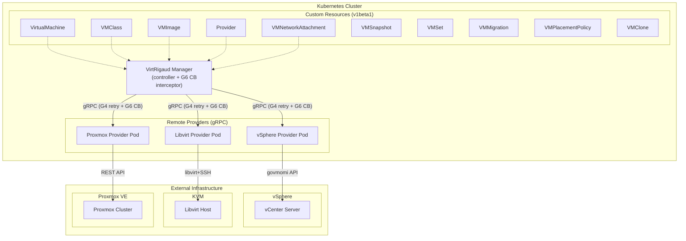

# VirtRigaud

A Kubernetes operator for managing virtual machines across multiple hypervisors.

**Version**: v0.3.6 — [CHANGELOG](CHANGELOG.md) | [Documentation](https://projectbeskar.github.io/virtrigaud)

## Overview

VirtRigaud is a Kubernetes operator that enables declarative management of virtual machines across different hypervisor platforms. It provides a unified API for provisioning and managing VMs on vSphere, Libvirt/KVM, and Proxmox VE through a remote gRPC provider architecture.

The manager reconciles Kubernetes custom resources; each hypervisor runs as a separate provider pod. Manager and provider pods communicate over gRPC. Credentials are scoped to the Provider CR and never flow through the manager.

## Features

- **Multi-Hypervisor Support**: vSphere, Libvirt/KVM, and Proxmox VE simultaneously
- **Cross-Provider VM Migration**: Migrate VMs between hypervisors using PVC-backed storage (currently tested: vSphere to Libvirt/KVM only; other directions are roadmap)
- **Multi-VM Management**: Declarative VM sets with rolling updates and replica management
- **Advanced Placement Policies**: Affinity, anti-affinity, and resource constraints
- **Declarative v1beta1 API**: Stable CRDs with OpenAPI validation
- **Cloud-Init Support**: Cross-provider VM initialisation via cloud-init
- **Power Management**: On/Off/Reboot/Graceful-Shutdown uniformly
- **Async Task Tracking**: Long-running vSphere and Proxmox operations tracked via TaskStatus RPC
- **Resource Reconfiguration**: CPU, memory, disk changes (online for vSphere/Proxmox; restart required for Libvirt)
- **G6 Circuit Breaker**: One circuit breaker per Provider CR for automatic failure isolation (v0.3.6+)
- **Observability**: 11 `virtrigaud_*` Prometheus metric families (1 deprecated in v0.3.6; removal in v0.4.0)

## Architecture

VirtRigaud uses a **Remote Provider** architecture for optimal scalability and reliability:


```mermaid
graph TB
    %% Kubernetes Cluster boundary
    subgraph "Kubernetes Cluster"

        %% CRDs
        subgraph "Custom Resources (v1beta1)"
            VM[VirtualMachine]
            VMC[VMClass]
            VMI[VMImage]
            PR[Provider]
            VMNA[VMNetworkAttachment]
            VMSN[VMSnapshot]
            VMSET[VMSet]
            VMMig[VMMigration]
            VMPP[VMPlacementPolicy]
            VMCL[VMClone]
        end

        %% Controller
        CTRL["VirtRigaud Manager
        (controller + G6 CB interceptor)"]

        %% Remote Providers
        subgraph "Remote Providers (gRPC)"
            VSP[vSphere Provider Pod]
            LVP[Libvirt Provider Pod]
            PXP[Proxmox Provider Pod]
        end

        %% Connections within cluster
        VM -.-> CTRL
        VMC -.-> CTRL
        VMI -.-> CTRL
        PR -.-> CTRL
        VMNA -.-> CTRL

        CTRL -->|"gRPC (G4 retry + G6 CB)"| VSP
        CTRL -->|"gRPC (G4 retry + G6 CB)"| LVP
        CTRL -->|"gRPC (G4 retry + G6 CB)"| PXP
    end

    %% External Infrastructure
    subgraph "External Infrastructure"
        subgraph "vSphere"
            VCENTER[vCenter Server]
        end
        subgraph "KVM"
            LIBVIRT[Libvirt Host]
        end
        subgraph "Proxmox VE"
            PVE[Proxmox Cluster]
        end
    end

    VSP -->|govmomi API| VCENTER
    LVP -->|libvirt+SSH| LIBVIRT
    PXP -->|REST API| PVE
```

### Security status (v0.3.6)

- **mTLS not yet default**: gRPC traffic between manager and provider pods is TLS-capable but mTLS is not wired through the provider `Resolver`; see issue [#147](https://github.com/projectbeskar/virtrigaud/issues/147).
- **Provider gRPC servers do not enforce authentication**: provider pods accept any client; see issue [#148](https://github.com/projectbeskar/virtrigaud/issues/148).
- **Libvirt SSH host-key verification skipped**: see issue [#149](https://github.com/projectbeskar/virtrigaud/issues/149).

For a full security disclosure, see the [Security Operations Guide](https://projectbeskar.github.io/virtrigaud/operations/security/).

## CRDs (10 total, all v1beta1)

| CRD | Short name | Description |
|-----|-----------|-------------|
| VirtualMachine | vm | A virtual machine instance |
| VMClass | vmc | Resource profile (CPU, memory, disk) |
| VMImage | vmi | Base template or image reference |
| VMNetworkAttachment | vmna | Network configuration |
| Provider | prov | Hypervisor connection + runtime config |
| VMMigration | vmmig | Cross-provider VM migration |
| VMSet | vmset | Multi-VM replica set |
| VMPlacementPolicy | — | Placement rules (affinity, resources) |
| VMSnapshot | — | Snapshot lifecycle management |
| VMClone | — | Cloning operations |

Note: VMAdoption is a **controller** built into the manager, not a CRD.

## Provider Feature Matrix

Per the [canonical capabilities matrix](https://projectbeskar.github.io/virtrigaud/providers/providers-capabilities/), verified against provider `GetCapabilities` responses in v0.3.6:

| Feature | vSphere | Libvirt | Proxmox | Notes |
|---------|---------|---------|---------|-------|
| **Core Operations** | ✅ | ✅ | ✅ | Create/Delete/Power/Describe |
| **Reconfiguration** | ✅ | ⚠️ | ✅ | Libvirt requires VM restart |
| **Disk Expansion** | ✅ | ⚠️ | ✅ | Libvirt: power-cycle required |
| **Snapshots** | ✅ | ✅ | ✅ | Point-in-time captures |
| **Memory Snapshots** | ❌ | ❌ | ✅ | RAM-inclusive snapshots (vSphere: no) |
| **Cloning (full)** | ✅ | ✅ | ✅ | Independent copies |
| **Linked Clones** | ✅ | ✅ | ✅ | COW-based (Libvirt: qcow2 backing) |
| **Clone RPC** | ✅ | ⚠️ [#153] | ✅ | Libvirt Clone RPC is a stub in v0.3.6 |
| **ImagePrepare RPC** | ✅ | ⚠️ [#154] | ✅ | Libvirt ImagePrepare is a stub in v0.3.6 |
| **Task Tracking** | ✅ | N/A | ✅ | Async operation monitoring |
| **Console URLs** | ✅ | ✅ | ⚠️ | Proxmox console URL: planned |
| **Guest Agent** | ✅ | ✅ | ✅ | IP detection and guest info |
| **Image Import** | ✅ | ✅ | ✅ | vSphere: OVA/content library |
| **Multi-NIC** | ✅ | ✅ | ✅ | Multiple network interfaces |
| **Circuit Breaker** | ✅ | ✅ | ✅ | One CB per Provider CR (v0.3.6) |

[#153]: https://github.com/projectbeskar/virtrigaud/issues/153
[#154]: https://github.com/projectbeskar/virtrigaud/issues/154

## Quick Start

### Prerequisites

- Kubernetes 1.25+
- Helm 3.10+
- Go 1.26+ (for source builds only)

### Installation via Helm (Recommended)

1. **Add the Helm repository**:
   ```bash
   helm repo add virtrigaud https://projectbeskar.github.io/virtrigaud
   helm repo update
   ```

2. **Install VirtRigaud** (version 0.3.6):
   ```bash
   helm install virtrigaud virtrigaud/virtrigaud \
     --version 0.3.6 \
     -n virtrigaud-system --create-namespace
   ```

   CRDs are installed automatically via Helm hooks. To disable automatic CRD upgrades:
   ```bash
   helm install virtrigaud virtrigaud/virtrigaud \
     --version 0.3.6 \
     -n virtrigaud-system --create-namespace \
     --set crdUpgrade.enabled=false
   ```

   > Providers are NOT enabled via Helm flags. Create Provider CRs (step 1 below) — the controller deploys provider pods automatically.

3. **Verify the installation**:
   ```bash
   kubectl get pods -n virtrigaud-system
   kubectl get crd | grep virtrigaud
   ```

4. **Upgrade**:
   ```bash
   helm upgrade virtrigaud virtrigaud/virtrigaud \
     --version 0.3.6 \
     -n virtrigaud-system
   ```

### Development Installation

```bash
# Install CRDs
make install

# Run the controller locally
make run
```

Go 1.26+ is required for source builds.

### Using VirtRigaud

1. **Create credentials secrets**:

   ```bash
   # Libvirt — SSH key (recommended)
   kubectl create secret generic libvirt-creds -n default \
     --from-literal=username=your-ssh-username \
     --from-file=ssh-privatekey=~/.ssh/id_rsa

   # Libvirt — password
   kubectl create secret generic libvirt-creds -n default \
     --from-literal=username=your-ssh-username \
     --from-literal=password='your-ssh-password'

   # vSphere
   kubectl create secret generic vsphere-creds -n default \
     --from-literal=username=administrator@vsphere.local \
     --from-literal=password='your-password'

   # Proxmox VE — API token (recommended; keys: token_id, token_secret)
   kubectl create secret generic proxmox-creds -n default \
     --from-literal=token_id='virtrigaud@pve!vrtg-token' \
     --from-literal=token_secret='xxxxxxxx-xxxx-4xxx-xxxx-xxxxxxxxxxxx'
   ```

   > The Proxmox provider reads credentials from files mounted at `/etc/virtrigaud/credentials/{token_id,token_secret,username,password}`. Do NOT use `envFrom: secretRef` for Proxmox credentials — that pattern is not implemented.

2. **Create a Provider CR**:

   ```yaml
   # Libvirt/KVM
   apiVersion: infra.virtrigaud.io/v1beta1
   kind: Provider
   metadata:
     name: libvirt-kvm
     namespace: default
   spec:
     type: libvirt
     endpoint: "qemu+ssh://192.168.1.10/system"
     credentialSecretRef:
       name: libvirt-creds
     runtime:
       image: "ghcr.io/projectbeskar/virtrigaud/provider-libvirt:v0.3.6"
       service:
         port: 9443
   ```

   ```yaml
   # vSphere
   apiVersion: infra.virtrigaud.io/v1beta1
   kind: Provider
   metadata:
     name: vsphere-datacenter
     namespace: default
   spec:
     type: vsphere
     endpoint: "https://vcenter.example.com:443"
     credentialSecretRef:
       name: vsphere-creds
     runtime:
       image: "ghcr.io/projectbeskar/virtrigaud/provider-vsphere:v0.3.6"
       service:
         port: 9443
   ```

   When you apply a Provider CR, the controller creates a dedicated Deployment and Service for the provider pod in the same namespace. Each Provider CR has isolated credentials.

3. **Deploy a VM**:

   ```bash
   kubectl apply -f examples/vm-ubuntu-small.yaml
   kubectl get virtualmachine -w
   ```

   See `examples/` for more examples.

## VM Migration

VirtRigaud supports VM migration between providers using PVC-backed storage.

**Currently tested**: vSphere → Libvirt/KVM only. Other directions (Libvirt → vSphere, any Proxmox path) are roadmap items and unverified.

Migration requires a `ReadWriteMany` StorageClass (NFS, CephFS, or similar):

```yaml
apiVersion: infra.virtrigaud.io/v1beta1
kind: VMMigration
metadata:
  name: vm-migration-example
  namespace: default
spec:
  source:
    vmRef:
      name: source-vm
  target:
    name: target-vm
    providerRef:
      name: target-provider
  storage:
    type: pvc       # Only "pvc" is supported — s3/http/nfs are not implemented
    pvc:
      storageClassName: nfs-migration-storage
      size: 100Gi
      accessMode: ReadWriteMany
```

For full migration documentation including provider restart behaviour, see the [Migration Guide](https://projectbeskar.github.io/virtrigaud/operations/vm-migration/).

## Observability

The manager exposes Prometheus metrics at `:8080/metrics` (HTTP by default; flip `--metrics-secure=true` for HTTPS).

11 of 12 `virtrigaud_*` metric families are wired in v0.3.6. `virtrigaud_queue_depth` is deprecated (use `workqueue_depth{name}` instead); removal scheduled for v0.4.0.

For the full metric catalog see [Observability](https://projectbeskar.github.io/virtrigaud/operations/observability/).

## Troubleshooting

### Missing CRDs after Helm install

```bash
# Check if CRDs were skipped
helm get values virtrigaud -n virtrigaud-system | grep skip-crds

# Manually install CRDs
kubectl apply -f charts/virtrigaud/crds/

# Or reinstall
helm uninstall virtrigaud -n virtrigaud-system
helm install virtrigaud virtrigaud/virtrigaud --version 0.3.6 \
  -n virtrigaud-system --create-namespace
```

## Development

### Building

```bash
make build          # Build the manager binary (requires Go 1.26+)
make docker-build   # Build container image
make test           # Run unit tests
make generate manifests  # Regenerate CRDs and DeepCopy
```

### Local Testing

```bash
# Quick lint check (before every commit)
./hack/test-lint-locally.sh

# Comprehensive CI testing (before PRs)
./hack/test-ci-locally.sh

# Test Helm charts with Kind cluster
./hack/test-helm-locally.sh
```

See [Testing Workflows Locally](docs/TESTING_WORKFLOWS_LOCALLY.md) for detailed instructions.

## Documentation

Primary documentation: **[https://projectbeskar.github.io/virtrigaud](https://projectbeskar.github.io/virtrigaud)**

In-tree design decisions: [`docs/adr/`](docs/adr/)

## Contributing

Contributions are welcome. See [CONTRIBUTING.md](CONTRIBUTING.md).

## Authors

- **William Rizzo** ([@wrkode](https://github.com/wrkode)) — project maintainer
- **Erick Bourgeois** ([@firestoned](https://github.com/firestoned)) — contributor

## License

Apache License 2.0 — see [LICENSE](LICENSE).
