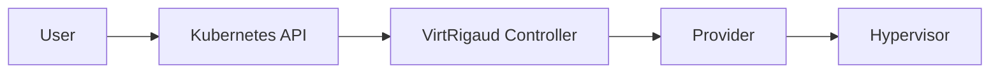

# VirtRigaud Documentation

This directory contains the source for VirtRigaud documentation built with [mdBook](https://rust-lang.github.io/mdBook/).

## 🌍 Multilingual Support

VirtRigaud documentation supports multiple languages. Currently available:

- **English** (`src/`) - Primary language

### Adding a Translation

See [TRANSLATION_GUIDE.md](TRANSLATION_GUIDE.md) for detailed instructions on contributing translations.

**Quick start:**

1. Copy the `src/` directory to `src-<language-code>/`
2. Translate all `.md` files
3. Add language configuration to `book.toml`
4. Submit a pull request

## 📚 Building Documentation

### Prerequisites

- [mdBook](https://rust-lang.github.io/mdBook/) (latest version)
- [mdbook-mermaid](https://github.com/badboy/mdbook-mermaid) (for diagrams)
- [Go](https://golang.org/) 1.23+ (for API docs generation)
- [crd-ref-docs](https://github.com/elastic/crd-ref-docs) (for CRD documentation)

### Installation

```bash
# Install mdBook
cargo install mdbook

# Install mdbook-mermaid
cargo install mdbook-mermaid

# Install mdbook-mermaid support
mdbook-mermaid install .

# Install crd-ref-docs
go install github.com/elastic/crd-ref-docs@latest
```

### Build Commands

```bash
# Build English documentation (default)
cd docs
mdbook build

# Build all languages (if translations exist)
mdbook build

# Serve locally for development
mdbook serve --open

# Clean build artifacts
mdbook clean
```

### Using Make

From the project root:

```bash
# Generate API documentation from Go source
make docs-api

# Build complete documentation
make docs-build

# Serve documentation locally
make docs-serve

# Clean documentation build
make docs-clean
```

## 📁 Directory Structure

```
docs/
├── book.toml              # mdBook configuration
├── README.md              # This file
├── TRANSLATION_GUIDE.md   # Translation instructions
├── src/                   # English documentation source
│   ├── SUMMARY.md         # Table of contents (MUST be uppercase)
│   ├── readme.md          # Introduction
│   ├── getting-started/   # Getting started guides
│   ├── guide/             # User guides
│   ├── advanced/          # Advanced topics
│   ├── operations/        # Operations & troubleshooting
│   ├── development/       # Developer guides
│   ├── api-reference/     # API documentation
│   └── ...
├── src-fr/                # French translation (example, when added)
├── theme/                 # Custom CSS and assets
│   └── custom.css
├── mermaid.min.js         # Mermaid diagram library
└── mermaid-init.js        # Mermaid initialization
```

## 🎨 Customization

### Theme

Custom CSS is in `theme/custom.css`. Modify this file to change the documentation appearance.

### Mermaid Diagrams

Mermaid diagrams are supported for architecture and flow diagrams:

````markdown

````

## 🚀 Deployment

Documentation is automatically built and deployed to GitHub Pages when changes are pushed to the `main` branch.

The CI workflow (`.github/workflows/docs.yml`) handles:
- Generating CRD documentation from Go source
- Building all language versions
- Creating a language selector page (if multiple languages)
- Deploying to GitHub Pages

## 📝 Writing Documentation

### Style Guide

- Use clear, concise language
- Include code examples for technical concepts
- Add mermaid diagrams for complex architectures
- Link to related pages using relative paths
- Use admonitions for important notes:

```markdown
> **Note**: Important information here

> **Warning**: Critical warning here

> **Tip**: Helpful tip here
```

### File Naming

- Use lowercase with hyphens: `my-page-name.md`
- Keep names descriptive but concise
- Match directory names to content themes
- **Exception**: `SUMMARY.md` MUST be uppercase (mdBook requirement)

### Link Format

Use relative links to other pages:

```markdown
See [Installation Guide](../installation/installation.md) for details.
```

## 🧪 Testing

Before submitting documentation changes:

1. **Build locally**: `mdbook build`
2. **Check for errors**: Look for build warnings
3. **Test links**: Verify all internal links work
4. **Preview**: `mdbook serve` and review in browser
5. **Validate markdown**: Use a linter like markdownlint

## 🤝 Contributing

We welcome documentation contributions!

1. Fork the repository
2. Create a feature branch
3. Make your changes
4. Test locally
5. Submit a pull request

For translations, see [TRANSLATION_GUIDE.md](TRANSLATION_GUIDE.md).

## 📖 Resources

- [mdBook Documentation](https://rust-lang.github.io/mdBook/)
- [mdBook User Guide](https://rust-lang.github.io/mdBook/guide/creating.html)
- [Mermaid Documentation](https://mermaid-js.github.io/mermaid/)
- [Markdown Guide](https://www.markdownguide.org/)

## 🐛 Issues

Found a problem with the documentation?

- [Open an issue](https://github.com/projectbeskar/virtrigaud/issues)
- [Start a discussion](https://github.com/projectbeskar/virtrigaud/discussions)

## 📜 License

Documentation is licensed under [CC BY 4.0](https://creativecommons.org/licenses/by/4.0/).

Code examples in documentation are licensed under [Apache 2.0](../LICENSE).
