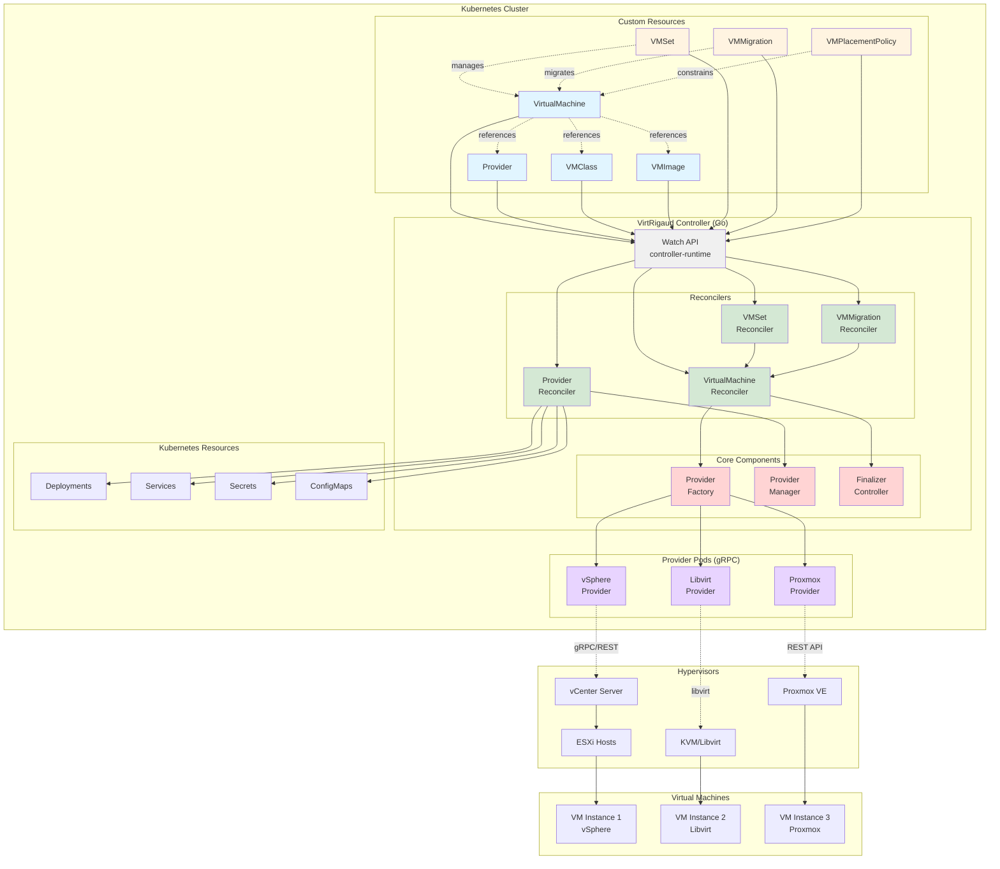
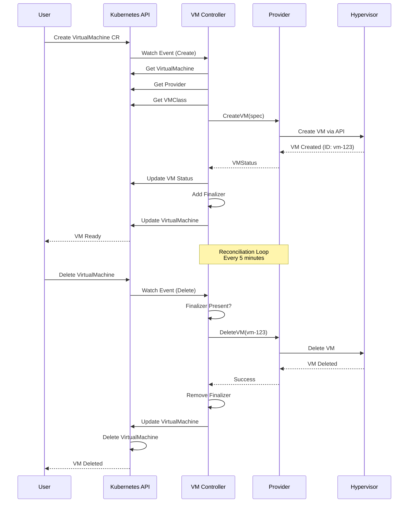
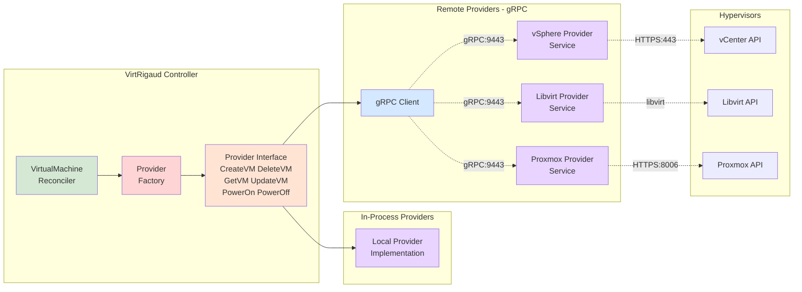
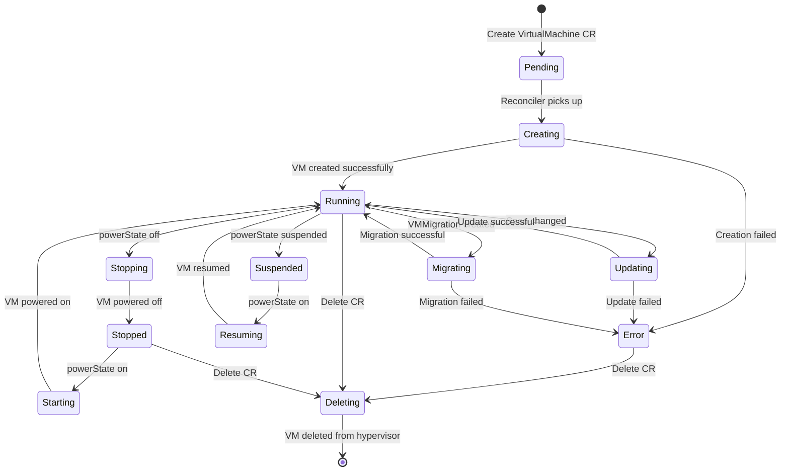
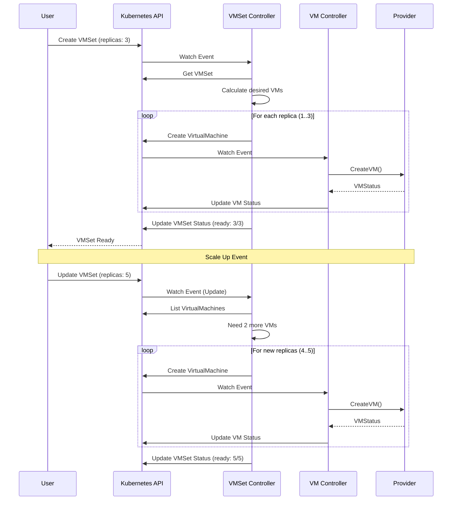
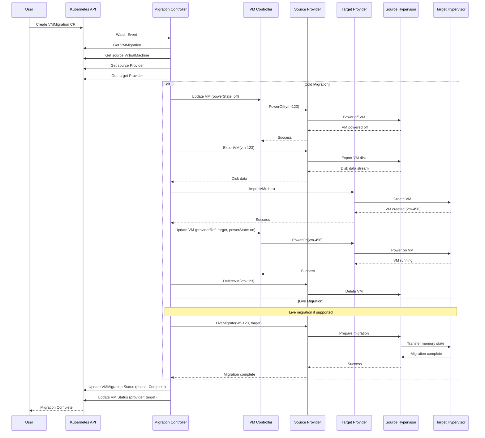
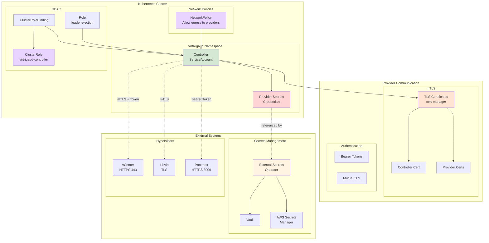
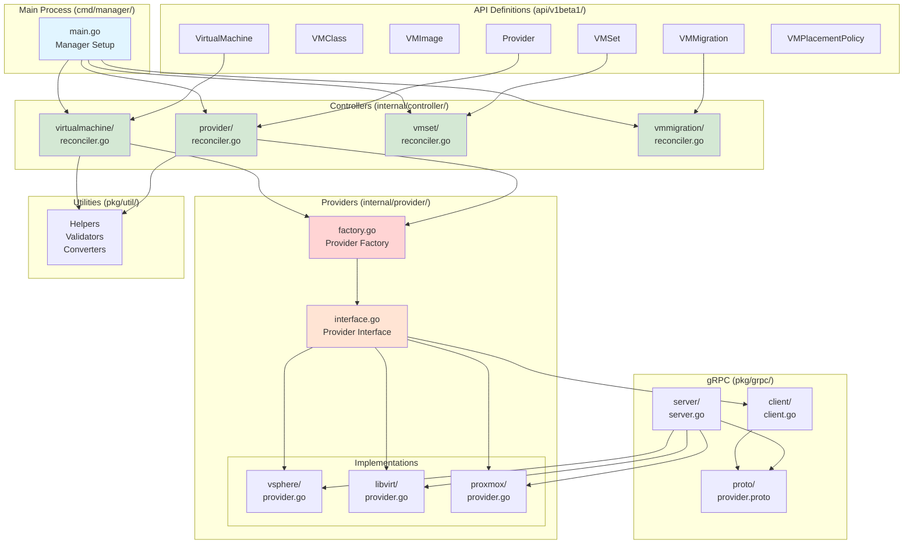
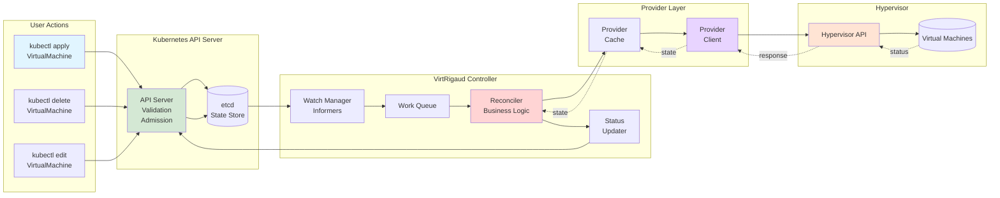
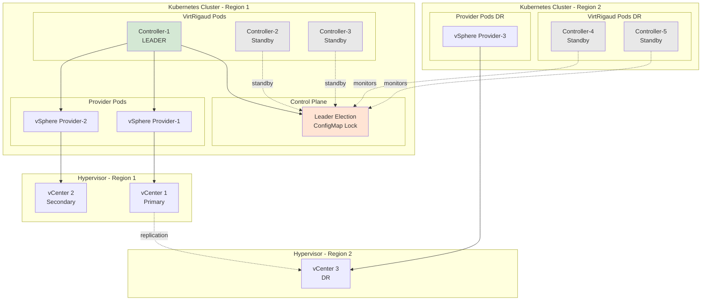

# Architecture Diagrams

Comprehensive visual diagrams showing VirtRigaud's architecture, components, and data flows.

## System Architecture

## VirtualMachine Reconciliation Flow

## Provider Architecture

## VM Lifecycle State Machine

## VMSet Scaling Flow

## Migration Flow

## Security Architecture

## Controller Components (Go)

## Data Flow

## High Availability Setup

## Related Documentation

- [Architecture Overview](architecture.md) - Detailed architecture explanation
- [Provider Architecture](../providers.md) - Provider implementation details
- [Remote Providers](../remote-providers.md) - gRPC provider architecture
- [Security](../security.md) - Security model and best practices
- [High Availability](../advanced/ha.md) - HA deployment patterns
