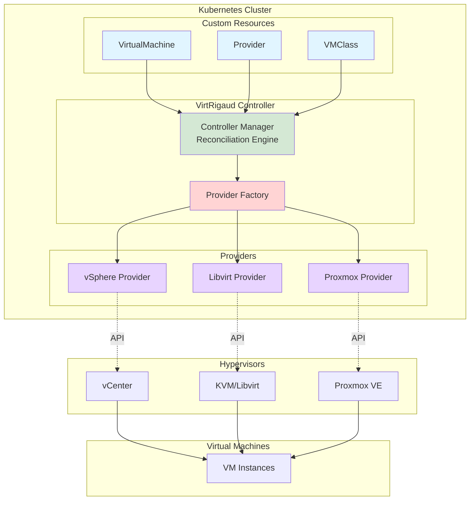
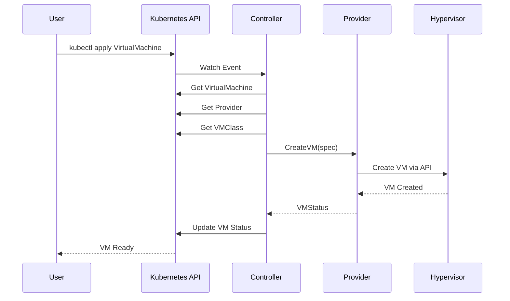
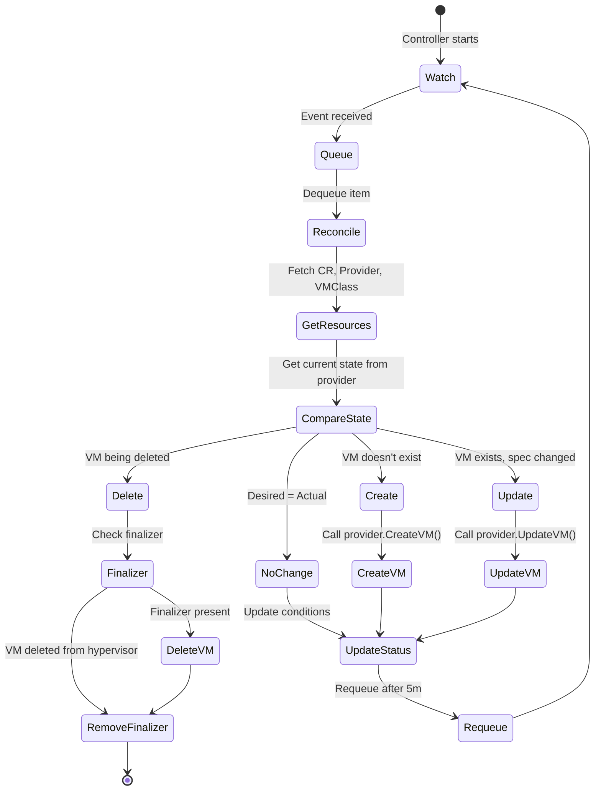

# Architecture Overview

VirtRigaud's architecture and design principles.

## Design Goals

1. **Kubernetes-native** - Use CRDs and controllers
2. **Multi-hypervisor** - Support vSphere, Libvirt, Proxmox
3. **Scalable** - Handle thousands of VMs
4. **Extensible** - Easy to add new providers
5. **Secure** - Zero-trust security model

## High-Level Architecture

## Components

### Controller Manager

Core reconciliation logic:
- Watches CRD changes
- Reconciles desired vs actual state
- Updates resource status
- Manages finalizers

### Providers

Provider implementations:
- **In-process** - Compiled into controller
- **Remote** - Separate pods via gRPC

See [Remote Providers](../remote-providers.md).

### CRDs

Kubernetes Custom Resource Definitions:
- VirtualMachine
- Provider
- VMClass
- VMImage
- VMMigration
- VMSet
- VMPlacementPolicy

See [CRDs](../crds.md).

## Data Flow

## Reconciliation Loop

The reconciliation process:

1. **Watch** - Monitor CRD changes via Kubernetes API
2. **Queue** - Add reconciliation requests to work queue
3. **Fetch** - Get VirtualMachine, Provider, VMClass resources
4. **Compare** - Fetch current state from provider and compare with desired
5. **Execute** - Create, update, or delete VM as needed
6. **Update Status** - Set status conditions reflecting current state
7. **Requeue** - Schedule next reconciliation (default: 5 minutes)

See [Status Update Logic](status-update-logic.md) for detailed status management.

## Provider Architecture

See [Provider Architecture](../providers.md) for details on the provider abstraction layer.

## Security Model

- mTLS for provider communication
- Kubernetes RBAC for access control
- Secret-based credential storage
- Network policies for isolation

See [Security](../security.md).
